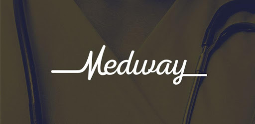

<!-- ---
layout: post
title: Medway Student Allocation
date: 2020-08-06
---

### What is medway?

 

[Medway João Pessoa](https://www.instagram.com/medwayjp/) is a preparatory course for ENEM (Brazilian SAT) and other tests (private universities). Medway has more than 200 students enrolled and counts with a system that's different from its competitors. The difference relies on the way the company treats its students. Medway has several workers that have experience with ENEM and are responsible for advising the students in their path. These employees are named *assessor* (some kind of Advisor/Organizer) who usually are students that have already passed the ENEM with high scores and are considered communicative.

### Problem Overview

The problem here is that each advisor has normally 16 students with whom he must speak weekly, to know how they are doing on their studies, how were their grades on the simulations and how are they doing in general. However, these students are allocated without constraints. Therefore, some advisors get students that are not 100% compatible with them and that need more attention during the week. These two problems are responsible for difficulting the job and for burning out some of the advisors.

With this scenario in mind, my main objective in this work was trying to make things more balanced, so the students and the advisors can enjoy their roles in the best way possible. Maximizing the total compatibility and letting the work balanced.

In order to do so, I thought of crafting some sort of compatibility metric. With the help of my bosses and some of the universities professors, I have made a Google forms with questions about different aspects of each student and each advisor life. Some of the information that was asked is listed below:

* Age
* Gender
* Degree that intends to pursuit
* Organization Level
* Religion
* Extrovertion level
* Sensibility level
* Prefered subject
* Political vision
* and many others...

The may concern in asking so many questions from different life aspects was to make a good compatibility modeling.

After deciding the questions, I have sent the Google Forms link for all the 250+ students and all the 18 advisors. After that I made another document where I asked each advisor to write how much time they use to spend with each of their students in the following scale:

  

    <table border = "1">
        <tr>
            <td>Até 5</td>
            <td>entre 5 e 10</td>
            <td>entre 10 e 15</td>
            <td>entre 15 e 20</td>
            <td>entre 20 e 25</td>
            <td>25+</td>
        </tr>
        <tr>
            <td>0</td>
            <td>1</td>
            <td>2</td>
            <td>3</td>
            <td>4</td>
            <td>5</td>
        </tr>
    </table>
  

As in all project that depends on to many factors, although all the advisors had responded, I ended up with 170 student responses.

Some of the questions were also used for contraints purpose. The preference for the advisor being from the same sex, for example, resulted in a negative M in the compatibility matrix, therefore eliminating that possibility. -->